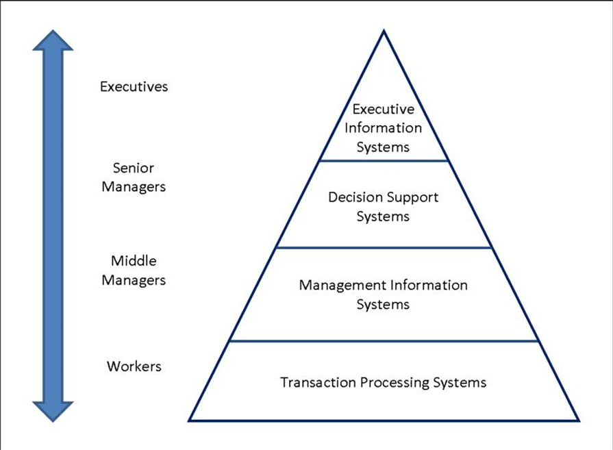

# 1.1. Khái quát về an toàn thông tin
- Chúng ta sống trong "thế giới kết nối" với mức độ ngày càng "sâu"
- Ngày càng có nhiều nguy cơ, đe dọa mất an toàn thông tin, 
hệ thống, mạng
- Ngày càng có nhiều nguy cơ, đe dọa mất an toàn thông tin, hệ thống, mạng: 
  - Bị tấn công từ tin tặc 
  -  Bị tấn công hoặc lạm dụng từ người dùng
  - Lây nhiễm các phần mềm độc hại (vi rút, sâu,...) 
  - Nguy cơ bị nghe trộm, đánh cắp và sửa đổi thông tin
  - Lỗi hoặc các khiếm khuyết phần cứng, phần mềm

## Hệ thống thông tin là gì?
- Hệ thống thông tin (IS - Information System) là một hệ thống tích hợp các thành phần nhằm phục vụ việc thu thập, lưu trữ, xử lý thông tin và chuyển giao thông tin, tri thức và các sản phẩm số.
- Sử dụng HTTT để quản lý các hoạt động:
  - Tương tác với: Khách hàng, nhà cung cấp, cơ quan chính quyền
  - Quảng bá thương hiệu và sản phẩm
  - Cạnh tranh với các đối thủ trên thị trường

## Các loại hệ thống thông tin(mô hình tháp)
- Gồm 4 loại theo đối tượng sử dụng

    

  - Hệ thống thông tin **giao dịch(Transactional Processing Systems**) với người sử dụng là các **nhân viên(Workers)**.
  - Hệ thống thông tin **quản lý(Management Information Systems)** với người sử dụng là các **quản lý bộ phận(Middle Managers)**
  - Hệ thống **trợ giúp ra quyết định(Decision Support Systems)** với người sử dụng là các **quản lý cao cấp(Senior Managers)**
  - Hệ thống thông tin **điều hành(Executive Information Systems**) với người sử dụng là các **Giám đốc điều hành(Executives)**

## Một số hệ thống thông tin điển hình
- Các kho dữ liệu (data warehouses)
- Các hệ lập kế hoạch nguồn lực doanh nghiệp (enterprise resource planning)

## Hệ thống thông tin dựa trên máy tính(Computer-Based Information System)
- Là một hệ thống thông tin sử dụng công nghệ máy tính để thực thi các nhiêm vụ

## Các thành phần của hệ thống thông tin dựa trên máy tính
- `Hardware`: Phần cứng để thu thập, lưu trữ, xử lý và biểu diễn dữ liệu
- `Software`: Các phần mềm chạy trên phần cứng để xử lý dữ liệu
- `Databases`: Lưu trữ dự liệu
- `Networks`: Hệ thống truyền dẫn thông tin/dữ liệu
- `Procedures`: Tập hợp các lệnh kết hợp các bộ phận nêu trên để xử lý dữ liệu, đưa ra kết quả mong muốn

## An toàn thông tin(Information Security) là gì?
- An toàn thông tin là việc bảo vệ chống truy nhập, sử dụng, tiết lộ, 
sửa đổi, hoặc phá hủy thông tin một cách trái phép.

## Hai lĩnh vực chính của ATTT:
- An toàn công nghệ thông tin (IT security)
- Đảm bảo thông tin(Information Assurance):
  -  Đảm bảo thông tin không bị mất khi xảy ra các sự cố (thiên tai, hỏng hóc hệ thống, trộm cắp, phá hoại,…)
  -  Sử dụng backup

## An toàn hệ thống thông tin (ISS - Information Systems Security) 
Là việc đảm bảo các thuộc tính an ninh an toàn của hệ thống thông tin:
- `Bí mật` (Confidentiality)
- `Toàn vẹn` (Integrity)
- `Sẵn dùng` (Availability)

# 1.2. Các yêu cầu đảm bảo ATTT và an toàn HTTT
## Tính bí mật(Confidentiality)
- Chỉ người dùng có thẩm quyền mới được truy nhập thông tin 

## Các thông tin bí mật gồm
- Dữ liệu riêng của cá nhân
- Các thông tin thuộc quyền sở hữu trí tuệ của các doanh nghiệp hay các cơ quan/tổ chức.
- Các thông tin có liên quan đến an ninh quốc gia

## Tính bí mật được đảm bảo bằng kênh mã hòa VPN
## Tính toàn vẹn (Integrity)
- Thông tin chỉ có thể được sửa đổi bởi những người dùng có thẩm quyền

## Tính toàn vẹn liên quan đến tính hợp lệ (validity) và chĩnh xác (accuracy) của dữ liệu
- Trong nhiều tổ chức, thông tin có giá trị lớn, như bản quyền phần mềm, bản quyền âm nhạc, bản quyền phát minh, sáng chế
- Mọi thay đổi không có thẩm quyền có thể ảnh hưởng rất nhiều đến giá trị của thông tin 