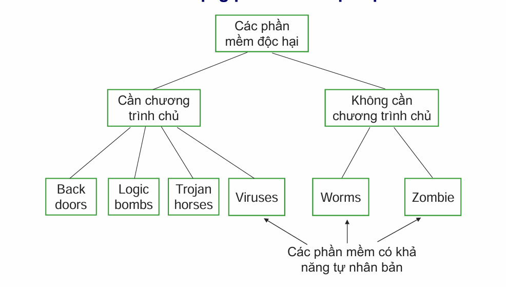

# 3.1. Khái quát về mối đe dọa, lỗ hổng và tấn công
## Mối đe dọa (Threat)

Là bất kỳ một hành động nào có thể gây hư hại đến các tài nguyên hệ thống(gồm phần cứng, phần mềm, CSDL, các file, dữ liệu hoặc hạ tầng mạng vật lý, ...)

## Điểm yếu (Weakness) 

Điểm yếu là một lỗi hoặc một khiếm khuyết tồn tại trong hệ thống

Các hệ thống luôn tồn tại điểm yếu

## Lỗ hổng (Vulnerability) 

Lỗ hổng là bất kỳ điểm yếu nào trong hệ thống cho phép mỗi đe dọa có thể gây tác hại

## Quan hệ giữa Mối đe dọa và Lỗ hổng
- Các mối đe dọa thường khai thác 1 hoặc 1 số lỗ hổng đã biết để thực hiện các cuộc tấn công phá hoại
- Nếu tồn tại 1 lỗ hổng trên hệ thống, sẽ có khả năng 1 mối đe dọa trở thành hiện thực
- Không thể triệt tiêu được hết các mối đe dọa, nhưng có thể giảm thiểu các lỗ hổng, qua đó giảm thiểu khả năng bị tận dụng để tấn công

## Không phải các mỗi đe dọa là độc hại (malicious)
- Một số là cố ý
- Một số có thể là ngẫu nhiên / vô tình

## Các lỗ hổng tồn tại trong cả 7 vùng của nền tảng CNTT

## Các lỗ hổng tồn tại trong hệ điều hành và các phần mềm ứng dụng
- Lỗi tràn bộ đệm (buffer overflows)
- Không kiểm tra đầu vào (unvalidated input)
- Các vấn đề với điều khiển truy cập (access-control problems)
- Các điểm yếu trong xác thực, trao quyền (weaknesses in authentication, authorization)
- Các điểm yếu trong các hệ mật mã (weaknesses in cryptographic practices)

## Tấn công độc hại/phá hoại (Malicious attacks)

- Tấn công = Mối đe dọa + lỗ hổng

## Các loại tấn công: 4 loại chính:
- Giả mạo(Fabrications): Giả mạo thông tin thường để đánh lừa người dùng thông thường
- Chặn bắt(Interceptions): liên quan đến việc nghe trộm trên đường truyền và chuyển hướng thông tin để sư dụng trái phép
- Gây ngắt quãng(Interruptions): gây ngắt kênh truyền thông ngăn cản việc truyền dữ liệu
- Sửa đổi(Modifications): Liên quan đến việc sửa đổi thông tin trên đường truyền hoặc sửa đổi dữ liệu file

## Hai kiểu tấn công
- Tấn công chủ động(Active attacks):
  - Sửa đổi dữ liệu trên đường truyền
  - Sửa đổi dữ liệu trong file
  - Giành quyền truy nhập trái phép vào máy tính hoặc hệ thống mạng
  - Tấn công chủ động là một đột nhập về mặt vật lý
- Tấn công thụ động(Passive attacks):
  - Không gây ra thay đổi trên hệ thống
  - Nghe lén
  - Giám sát lưu lượng trên đường truyền

# 3.2. Các công cụ hỗ trợ tấn công
## Công cụ tấn công (Attack tools)

Là các công cụ phần cứng, phần mềm, hoặc các kỹ thuật hỗ trợ giúp kẻ tấn công (attacker) tấn công vào các hệ thống máy tính hoặc các tài nguyên mạng

## Một số công cụ và kỹ thuật hỗ trợ tấn công
- Công cụ quét lỗ hổng (Vulnerability scanners)
- Công cụ quét cổng dịch vụ (Port scanners)
- Công cụ nghe lén (Sniffers)
- Công cụ ghi phím gõ (Keyloggers)

### Công cụ quét lỗ hổng(Vulnerability scanners)
- Thu thập thông tin về các điểm yếu/lỗ hổng đã biết của hệ thống máy tính hoặc mạng
- Gửi những thông điệp được tạo đặc biệt để kiểm tra điểm yếu/lỗ hổng đến hệ thống máy tính cần rà quét. Nếu hệ thống phản hồi -> điểm yếu vẫn tồn tại

### Công cụ quét cổng dịch vụ(Port scanners)
- Công cụ quét cổng kết nối đến máy tính để xác định cổng nào được 
mở và có thể truy nhập vào máy tính. Từ đó xác định được dịch 
vụ/ứng dụng nào đang chạy trên hệ thống

### Cộng cụ nghe trộm (Sniffers)
- Công cụ nghe trộn cho phép bắt các gói tin khi chúng được truyền trên mạng
- Có thể là module phần cứng, phần mềm hoặc kết hợp
- Các thông tin nhạy cảm như mật khẩu nếu không được mã hóa thì 
có thể bị kẻ tấn công nghe trộm khi được truyền từ máy trạm đến máy 
chủ và bị lạm dụng

### Công cụ ghi phím gõ (Keyloggers)

- Công cụ ghi phím gõ là một dạng công cụ giám sát có thể bằng phần 
cứng hoặc phần mềm có khả năng ghi lại mọi phím người dùng gõ và 
lưu vào 1 file

# 3.3. Các dạng tấn công phá hoại thường gặp 

| STT | Type                             |
| --- | -------------------------------- |
| 1   | Tấn công vào mật khẩu            |
| 2   | Tán công bằng mã độc             |
| 3   | Tấn công từ chối dịch vụ         |
| 4   | Tấn công giả mạo địa chỉ         |
| 5   | Tấn công nghe trộm               |
| 6   | Tấn công kiểu người đứng giữa    |
| 7   | Tấn công bằng bom thư và thư rác |
| 8   | Tấn công sử dụng cửa hậu         |
| 9   | Tấn công kiểu Social Engineering |
| 10  | Tấn công phishing, pharming      |

## Tấn công vào mật khẩu
- Là hình thức đánh cắp tên đăng nhập và mật khẩu để chiếm quyền truy cập, lạm dung tại khoản người dùng
- Mật khẩu có thể bị đánh cắp khi:
  - Dữ liệu không được mã hóa trên đường truyền từ máy khách đến máy chủ
  - Thông qua các hình thức XSS hoặc Social Engineering (lừa người dùng tự cung cấp thông tin)
  
### Các dạng tấn công bằng mật khẩu
- Tấn công từ điển (Dictionary attack): thư các mật khẩu phổ biến có trong từ điển
- Tấn công vét cạn (Brute force attack): thử mọi tổ hớp ký tự, thường áp dụng với mk đã mã hóa 

### Biện pháp phòng chống
- Sử dụng mật khẩu mạnh
- Thay đổi mật khẩu định kỳ

## Tấn công bằng mã độc
- Là hình thức khai thác lỗ hổng lập trình hoặc cấu hình hệ thống để chèn và thực thi mã độc trên hệ thống nạn nhân
- Các hình thức phổ biến:
  - Khai thác lỗi tràn bộ đệm (Buffer Overflow)
  - Khai thác lỗi không kiểm tra dữ liệu đầu vào 
    - SQL injection
    - XSS, CSRF
  - Lừa người dùng tải và cài phần mềm độc hại: Virus, Trojan

### Tấn công lợi dụng lỗi không kiểm tra đầu vào
- Mọi dữ liệu đầu vào cần được kiểm tra về định dạng và kích thước, gồm:
  - Trường text, tham số URL, file upload, tham số dòng lệnh, dữ liệu từ mạng
- Kẻ tấn công thử nhiều giá trị bất thường, để khai thác lỗi
- Hậu quả:
  - Gây lỗi ứng dụng, làm dịch vụ ngừng hoạt động
  - Chèn mã SQL để tấn công CSDL

### SQL Injection
- Là kỹ thuật chèn mã SQL vào dữ liệu đầu vào để máy chủ CSDL thực thi.
- Nguyên nhân:
  - Không kiểm tra hoặc kiểm tra kém dữ liệu đầu vào
  - Sử dụng câu lệnh SQL động, ghép trực tiếp dữ liệu người dùng vào câu SQL
- Hậu quả: 
  - Vượt qua xác thực đăng nhập
  - Chèn, sửa, xóa dữ liệu
  - Đánh cắp thông tin CSDL
  - Chiếm quyền điều khiển hệ thống

### Các hình thức khai thác SQL Injection
- Vượt qua đăng nhập: dùng điều kiện luôn đúng (`OR 1=1--`)
- Sửa, xóa, chèn dữ liệu: dùng `DELETE`, `UPDATE`, `INSERT`
- Đánh cắp dữ liệu: 
- Chiếm quyền điều khiển hệ thống

### Phòng chống SQL Injection
- Kiểm tra và lọc dữ liệu đầu vào:
  - Kiểm tra định dạng, độ dài
  - Lọc ký tự đặc biệt và từ khóa SQL nguy hiểm
- Sử dụng `stored procedures`
  - Tách dữ liệu khỏi mã SQL
  - Hạn chế SQL động
- Hạn chế quyền truy cập SQL
- Vô hiệu hóa các thủ tục hệ thống nguy hiểm

## Tấn công từ chối dịch vụ
- Là dạng tấn công cản trở người dùng hợp pháp truy nhập các tài nguyên hệ thống

### Hai loại tấn công DoS:
- Tấn công logic (Logic attacks): tấn công dựa vào các lỗi phần mềm làm dịch vụ ngừng hoạt động hoặc làm giảm hiệu năng hệ thống
  
  > Cần cài đặt các bản cập nhật thường xuyên để phòng chống

- Tấn công gây ngập lụt (Flooding attacks): Kẻ tấn công gửi một lượng lớn yêu cầu gây cạn kiệt tài nguyên hệ thống hoặc băng thông đường truyền mạng

### Hai kỹ thuật gây ngập lụt
- SYN floods
- Smurf

#### SYN floods
- Là kỹ thuật gây ngập lụt các gói tin TCP
- SYN là bít điều khiển của TCP dùng để đồng bộ số trình tự gói

##### Kịch bản
- Kẻ tấn công gửi 1 lượng lớn SYN-REQ đến máy tính nạn nhân
- Máy tính nạn nhân ghi nhậ yêu cầu kết nối và dành 1 chỗ trong bảng lưu kết nối trong bộ nhớ cho phép yêu cầu kết nối
- Sau đó gửi lại gói SYN-ACK nhưng kẻ tấn công không bao giờ gửi lại gói ACK để xác nhận kết nối -> bảng kết nối của nạn nhân đầy và người dùng hợp pháp không thể truy cập
- Máy tính nạn nhân chỉ có thể xóa yêu cầu kết nối khi nó timed-out

##### Phân tích
- Kẻ tấn công thường dùng địa chỉ IP giả mạo không có thực làm source IP trong gói tin nên thông điệp SYN-ACK của máy tính nạn nhân không bao giờ đến đích

##### Phòng chống
-  Sử dụng kỹ thuật lọc (Filtering): cần sửa đổi giao thức TCP không cho 
phép kẻ tấn công giả mạo địa chỉ;
- Tăng kích thước Backlog: tăng kích thước bảng Backlog lưu các yêu 
cầu → tăng khả năng phục vụ yêu cầu;
- Giảm thời gian chờ (SYN-RECEIVED Timer): các kết nối chưa được 
xác nhận sẽ bị xóa khi hết thời gian chờ;
- SYN cache: yêu cầu kết nối chỉ được cấp phát không gian nhớ đầy đủ 
khi nó được xác nhận;
- Sử dụng Firewalls và Proxies

#### Smurf
- Sử dụng kiểu phát quảng bá có định hướng để gây ngập lụt đường truyền mạng của máy nạn nhân

##### Kịch bản
- Kẻ tấn công gửi quảng bá một lượng lớn gói tin ICMP(Ping) với địa chỉ IP nguồn là địa chỉ IP của máy nạn nhân đến một mạng sử dụng một địa chỉ quảng bá (IP Broadcast address)
- Các máy khác trong mạng nhận được thông điệp ICMP sẽ gửi trả lời đến máy có địa chỉ IP nguồn(máy nạn nhân)

##### Phòng chống
-  Cấu hình các máy và router không trả lời các yêu cầu ICMP hoặc các 
yêu cầu phát quảng bá;
- Cấu hình các router không chuyển tiếp yêu cầu gửi đến các địa chỉ 
quảng bá

### Tấn công DDoS (Distributed Denial of Service Attacks) 
- Là một loại tấn công DoS
-  Liên quan đến gây ngập lụt các máy nạn nhân với một lượng rất lớn 
các yêu cầu kết nối giả mạo
- DDoS khác DoS ở phạm vi tấn công (số lượng host tham gia)
  - Số host tham gia tấn công DoS thường giới hạn trong 1 hoặc 1 số máy
  - Số host tham gia tấn công DDoS có thể hàng chục ngàn và nằm phân tán trên mạng Internet

#### Kịch bản
- Kẻ tấn công chiếm quyền điều khiển hàng trăm thậm chí hàng ngàn 
máy tính trên mạng Internet, sau đó cài các chương trình tấn công tự 
động (Automated agents) lên các máy này;
- Sau đó, kẻ tấn công ra lệnh cho các automated agents đồng loạt tạo 
các yêu cầu giả mạo gửi đến các máy nạn nhân;
- Lượng yêu cầu giả mạo có thể rất lớn và đến từ rất nhiều nguồn khác 
nhau nên rất khó đối phó và lần vết để tìm ra kẻ tấn công

#### Reflective DDoS
- Nó sẽ giống với smurf khi các máy zombie gửi gói tin với source IP là IP máy nạn nhân đến số lượng lớn các máy khác và khi các máy này reply lại về IP máy nạn nhân sẽ dẫn đến việc ngập lụt ở máy nạn nhân

## Tấn công giả mạo địa chỉ IP (IP Spoofing)
- Là dạng tấn công trong đó kẻ tấn công sử dụng địa chỉ IP giả, thường để đánh lừa máy nạn nhân để vượt qua hàng rào kiểm soát an ninh
- Nếu kẻ tấn công giả địa chỉ IP là địa chỉ Local của mạng LAN, hắn có thể có nhiều cơ hội đột nhập vào các máy khác trong LAN do chính sách kiểm soát an ninh với các máy trong LAN thường được giảm nhẹ
- Nếu router hoặc firewall của mạng không được cấu hình để nhận ra IP 
giả mạo của mạng LAN nội bộ → kẻ tấn công có thể thực hiện

## Tấn công nghe lén (Sniffing)
Là dạng tấn công sử dụng thiết bị phần cứng hoặc phần mềm, lắng 
nghe trên card mạng, hub hoặc router để bắt các gói tin dùng cho 
phân tích về sau

## Tấn công kiểu người đứng giữa
- Lợi dụng quá trình chuyển gói tin đi qua nhiều trạm (hop) thuộc các 
mạng khác nhau
- Kẻ tấn công chặn bắt các thông điệp giữa 2 bên tham gia truyền thông và chuyển thông điệp lại cho bên kia
- Thường được sử dụng để đánh cắp thông tin

## Tấn công bằng bom thư và thư rác
- Tấn công bằng bom thư (Mail bombing) là dạng tấn công DoS khi kẻ tấn công chuyển 1 lượng lớn email đến nạn nhân
- Tấn công bằng thư rác (Spam emails)

## Tấn công kiểu Social Engineering
là dạng tấn công sử dụng các kỹ thuật xã hội đã thuyết phục người dùng tiết lộ thông tin truy nhập hoặc các thông tin có giá trị cho kẻ tấn công.

## Tấn công kiểu phishing
- Phishing là một dạng của tấn công Social Engineering, lừa 
người dùng để lấy thông tin cá nhân, thông tin tài khoản, thẻ 
tín dụng,…

## Tấn công kiểu pharming
Pharming là kiểu tấn công vào trình duyệt người dùng:
- Người dùng gõ địa chỉ 1 website, trình duyệt lại yêu cầu 1 website khác(độc hại)
- Kẻ tấn công thường sử dụng sâu, virus hoặc các phần mềm độc hại 
cài vào hệ thống để điều khiển trình duyệt của người dùng;
- Kẻ tấn công cũng có thể tấn công vào hệ thống DNS để thay đổi kết 
quả truy vấn: thay địa chỉ IP của website hợp pháp thành IP của 
website độc hại

## Tấn công APT
- Tấn công APT(Advanced Persistent Threat), hay còn được gọi là tấn công có chủ đích là hình thức tấn công tập trung
- Được thiết kế cho từng mục tiêu, từng đối tượng cụ thể nhằm mục đích tìm kiếm các thôgn tin giá trị và gửi ra bên ngoài

### Hai thuộc tính quan trọng của APT
- TIên tiến, cao cấp(Advanced): các kỹ thuật tiên tiến được sử dụng để tấn công vào hệ thống mục tiêu một cách bài bản
- Kiên trì(Persistent): mục tiêu được xác định rất cụ thể để thực hiện tấn công, ẩn mình và khai thác theo từng giai đoạn

### Các giai đoạn điển hình trong APT
- Truy cập ban đầu
- Thâm nhận lần đầu và triển khai mã độc
- Mở rộng truy cập và di chuyển ngang
- Giai đoạn tấn công
- Gây thiệt hại
- Tấn công tiếp theo

# 3.4. Các dạng phần mềm độc hại

## Logic Bombs
- Bom logic (Logic bombs) thường được “nhúng” vào các 
chương trình bình thường và thường hẹn giờ để “phát nổ” 
trong một số điều kiện củ thể
- Điều kiện để bom “phát nổ” có thể là:
  - Sự xuất hiện hoặc biến mất của các files cụ thể;
  - Một ngày nào đó, hoặc một ngày trong tuần
- Khi “phát nổ” bom logic có thể xoá dữ liệu, files, tắt cả hệ 
thống..

## Trojan horses
- Trojan horses chứa mã độc, thường giả danh những 
chương trình có ích, nhằm lừa người dùng kích hoạt chúng.
- Trojan horses thường được sử dụng để thực thi gián tiếp 
các tác vụ, mà tác giả của chúng không thể thực hiện trực 
tiếp do không có quyền truy nhập.
- `VD`: trong một hệ thống nhiều users, một user có thể tạo ra 
một trojan đội lốt một chương trình hữu ích đặt ở thư mục 
chung. Khi trojan này được thực thi bởi một user khác, 
nó sẽ cho phép tất cả các users truy nhập vào các files của 
user đó

## Back doors
- Cửa hậu thường được các lập trình viên tạo ra, dùng để gỡ rối và test 
chương trình
- Cửa hậu thường cho phép truy nhập trực tiếp vào hệ thống mà không 
qua các thủ tục kiểm tra an ninh thông thường
-  Khi cửa hậu được lập trình viên tạo ra để truy nhập hệ thống bất hợp 
pháp, nó trở thành một mối đe doạ đến an ninh hệ thống
- Rất khó phát hiện ra cửa hậu vì nó thường được thiết kế và cài đặt 
khéo léo: cửa hậu chỉ được kích hoạt trong một ngữ cảnh nào đó

## Virus
- Virus máy tính là chương trình có khả năng tự chèn mã vào các chương trình khác để lây nhiễm
- Khi chương trình bị nhiễm được thực thi, Virus sẽ:
  - Tự kích hoạt
  - Tiếp tục lây nhiễm sang các chương trình khác
- Virus có khả năng tự nhân bản, tự lây lan, tương tự virus sinh học

### Con đường lây nhiễm
- Sao chép file
- Email
- Gọi ứng dụng/dịch vụ qua mạng
- Khi chương trình nhiễm virus chạy -> virus tự động được thực thi

### Vòng đồi của Virus(4 giai đoạn)
1. Nằm im: Virus chưa được kích hoạt, chờ sự kiện

2. Phát tán: Sao chép và lây nhiễm sang chương trình khác

3. Kích hoạt: được kích hoạt theo điều kiện định sẵn

4. Thực hiện: thực thi hành vi (có thể vô hại hoặc phá hoại dữ liệu, chương trình)

### Cơ chế chèn mã virus
- Virus chèn mã vào đầu hoặc cuối chương trình chủ
- Khi chương trình chạy: 
  - Mã virus được thực hiện trước
  - Sau đso chương trình gốc mới được thực hiện

### Các loại virus phổ biến
- File Virus:

  - Lây vào file chương trình và file dữ liệu.

  - Gây hỏng chương trình, phá hủy dữ liệu, đánh cắp thông tin.

- Boot Virus:

  - Lây vào boot sector hoặc MBR.

  - Được nạp mỗi khi máy khởi động.

  - Có thể làm đĩa không truy cập được.

- Macro Virus:

  - Lây qua tài liệu MS Word/Office.

  - Hoạt động nhờ macro (VBA).

  - Có thể tự động chạy qua AutoExecute, Automacro…

  - Chiếm khoảng 2/3 số virus được phát hiện.

- E-mail Virus:

  - Tự gửi bản sao qua email tới danh bạ người dùng.

  - Kích hoạt khi mở email hoặc file đính kèm.

  - Lây lan rất nhanh trên diện rộng.

## Worms
- Worm (sâu máy tính) là phần mềm độc hại có khả năng tự lây lan từ máy này sang máy khác không cần sự tương tác của người dùng
- Khi nhiễm vào 1 máy, worm dùng máy đó làm "bàn đạp" để tiếp tục tấn công sang máy khác
- Worm chủ yếu lây lan qua mạng, sử dụng các kết nối mạng
- Khi hoạt động, worm có hành vi tương tự virus(tự nhân bản, gây hại)

### Các phương pháp lây lan của worms
- Qua email: gửi bản sao của worm đến các máy khác.

- Thực thi từ xa: khai thác lỗ hổng hệ điều hành, dịch vụ hoặc phần mềm để tự chạy trên máy khác.

- Đăng nhập từ xa: đăng nhập như một người dùng hợp lệ và sao chép bản thân sang máy khác.

## Zombie/Bot
- Là chương trình độc hại chiếm quyền điều khiển một máy tính có kết nối Internet
- Máy bị nhiễm trở thành máy "ma", bị kẻ tấn công điều khiển từ xa để tân công các hệ thống khác
- Bot có khả năng tự lây lan mà không cần sự tương tác cảu người dùng, tương tự worm

### Mục đích
- Chủ yếu dùng để:
  - Tấn công DDoS vào máy chủ / website lớn
  - Gửi thư rác
- Tin tặc kiểm soát số lượng lớn máy tính để tăng sức tấn công

### Botnet
- Botnet là tập hợp nhiều máy tính bot (zombie) dưới sự điều khiển của một hoặc nhiều kẻ tấn công.
- Các bot trong botnet được điều khiển thông qua hệ thống:

  - Command and Control (C&C) server

  - Dùng các giao thức phổ biến như HTTP, IRC

- Nhờ kiến trúc trung gian, rất khó lần vết và phát hiện kẻ điều khiển botnet.